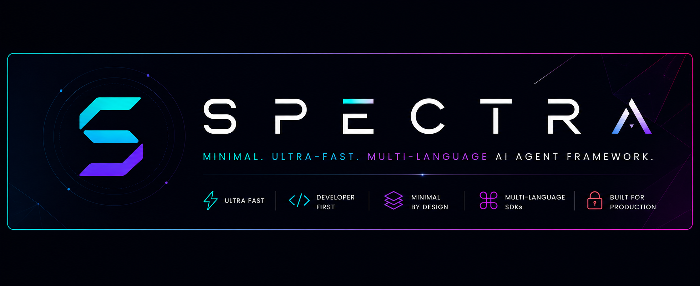
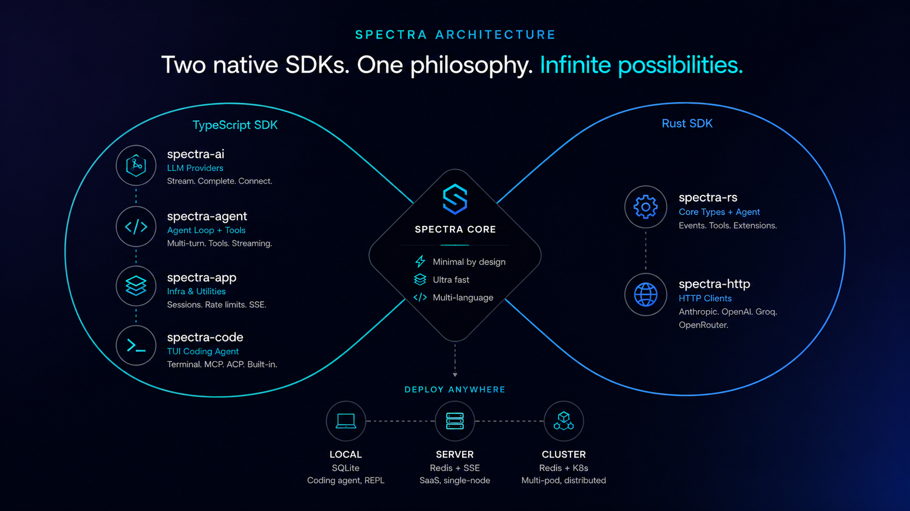
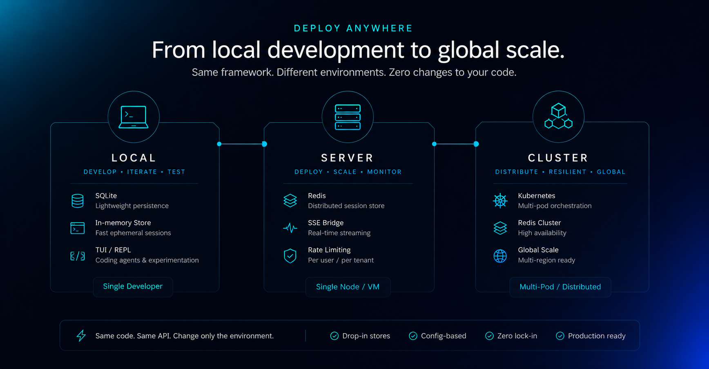

<p align="center">
  
</p>

<p align="center">
  <a href="https://github.com/codex-mohan/spectra/actions/workflows/ci.yml"></a>
  <a href="https://www.npmjs.com/package/@mohanscodex/spectra-agent"></a>
  <a href="https://www.npmjs.com/package/@mohanscodex/spectra-agent"></a>
  <a href="https://github.com/codex-mohan/spectra/blob/main/LICENSE"></a>
  <a href="https://github.com/codex-mohan/spectra/stargazers"></a>
  <a href="https://github.com/codex-mohan/spectra/pulls"></a>
</p>

# Spectra

**Minimal, ultra-fast, multi-language AI agent framework**

---

A construction kit, not a pre-built house — ship only primitives that enable developers to build anything beyond the core without fighting the framework.

Each SDK (TypeScript, Rust) is a **complete, independent native implementation** — same API surface, same behavior, no shared runtime, no bindings, no FFI.

## Why Spectra?

I built Spectra because I lost months debugging framework bugs instead of building my product.

Every agent framework I tried — **LangChain, LangGraph**, and others — followed the same pattern: endless layers of abstraction for things that are, at their core, just a simple loop. An agent takes input, calls a model, processes the response, dispatches tools, and repeats. That's it. A loop. Everything else — the chains, graphs, runnables, callbacks, tracing hooks, and configurable-everything — is just over-engineering dressed up as architecture.

The cost of this over-engineering is real. I spent weeks tracking down bugs that turned out to be SDK issues, not application logic. Deployment options were limited. And worst of all, these frameworks create **vendor lock-in** — your entire codebase becomes coupled to abstractions you didn't need in the first place.

**Spectra takes the opposite approach.** No graphs. No chains. No runtime that owns your application. Just the primitives — a loop, a model call, a tool dispatch, a stream — that you assemble however you need. If you can write a `for` loop, you can understand the entire framework in 10 minutes.

**Built for hackers who just want things to work. Ship what you mean, not what the framework lets you.**

### "But Spectra has rate limiters, circuit breakers, session stores..."

There's a difference between **abstractions you don't need** and **utilities everyone ends up building anyway.** LangChain invents chains, graphs, and runnables you never asked for. Rate limiting, circuit breakers, session persistence, SSE bridging — those aren't architecture opinions. They're infrastructure you'd write by hand in every production app. Spectra ships them as composable primitives so you don't spend 3 weeks building the same boilerplate every time.

Think of Spectra as two layers: a **lean core** (agent loop + tools + streaming) and a **utility belt** (rate limiting, session stores, health probes) — use what you need, ignore what you don't. The core never forces the belt on you.

---

## Architecture

<p align="center">
  
</p>

---

## Packages

| Package | Layer | Description |
|---------|-------|-------------|
| `@mohanscodex/spectra-ai` | **Provider** | LLM abstraction — stream, complete, register providers. Anthropic Messages + OpenAI Chat Completions with SSE streaming. Any OpenAI-compatible endpoint works via baseUrl. Core types (Message, Model, ToolCall, StopReason). |
| `@mohanscodex/spectra-agent` | **Agent** | Agent loop with multi-turn tool dispatch. `defineTool()` with Zod validation, before/after hooks, parallel/sequential execution, retry with backoff, abort support. |
| `@mohanscodex/spectra-app` | **Infrastructure** *(optional)* | Production utilities you'd build anyway — `SessionEngine`, `SessionManager`, `SessionStore`, `Rate Limiting`, `CircuitBreaker`, `SseBridge`, `HealthProbe`. |
| `@mohanscodex/spectra-code` | **TUI App** | Terminal-based AI coding agent built on the Spectra SDK. |
| `spectra-rs` | **Rust Core** | Rust SDK — core types, agent, tools, events. |
| `spectra-http` | **Rust HTTP** | Rust HTTP clients for Anthropic Messages + OpenAI Chat Completions. OpenRouter-compatible. |

## Feature Matrix

| Feature | TypeScript | Rust |
|---------|------------|------|
| Streaming SSE | ✅ | ✅ |
| Tool Dispatch (Parallel/Sequential) | ✅ | ✅ |
| Before/After Tool Hooks | ✅ | ✅ |
| Extension / Middleware System | ✅ | ✅ |
| Agent Loop (Multi-Turn) | ✅ | ✅ |
| Retry with Exponential Backoff | ✅ | ✅ |
| Session Management | ✅ | — |
| Session Persistence (FS + SQLite) | ✅ | — |
| Redis Session Store (distributed) | ✅ | — |
| Worker Pool | ✅ | ✅ |
| Rate Limiting (in-memory) | ✅ | ✅ |
| Redis Rate Limiting (distributed) | ✅ | — |
| Composite Rate Limiting (tenant+user+provider) | ✅ | — |
| Circuit Breaker | ✅ | ✅ |
| SSE Bridge (WS-compatible interface) | ✅ | — |
| Health Probe (K8s ready) | ✅ | ✅ |
| Agent Registry | ✅ | ✅ |
| Cost Tracking | ✅ | ✅ |
| Tool Choice / Reasoning Effort | ✅ | ✅ |
| Model Registry | ✅ | ✅ |
| Audit Trail / Provenance | ✅ | — |

## Quick Start

### TypeScript

```bash
bun add @mohanscodex/spectra-ai @mohanscodex/spectra-agent
```

```typescript
import { Agent, defineTool } from "@mohanscodex/spectra-agent";
import { z } from "zod";

const searchTool = defineTool({
  name: "search",
  description: "Search the web",
  parameters: z.object({ query: z.string() }),
  execute: async ({ query }) => ({
    content: [{ type: "text", text: `Results for: ${query}` }],
  }),
});

const agent = new Agent({
  model: {
    id: "claude-sonnet-4-5",
    provider: "anthropic",
    api: "messages",
  },
  systemPrompt: "You are a helpful assistant.",
  tools: [searchTool],
});

for await (const event of agent.run("What is Rust?")) {
  if (event.type === "message_update") {
    console.log(event.message.content);
  }
}
```

## Deployment

<p align="center">
  
</p>

### TypeScript — Production

```bash
bun add @mohanscodex/spectra-ai @mohanscodex/spectra-agent @mohanscodex/spectra-app ioredis
```

### TypeScript — TUI Coding Agent

```bash
bun add -g @mohanscodex/spectra-code
```

### Rust

```toml
[dependencies]
spectra-rs = { git = "https://github.com/codex-mohan/spectra" }
spectra-http = { git = "https://github.com/codex-mohan/spectra" }
tokio = { version = "1", features = ["full"] }
```

## Supported APIs

Spectra works with any endpoint that speaks Anthropic's Messages API or OpenAI's Chat Completions API — just set `baseUrl` on your model.

| Protocol | TypeScript | Rust |
|----------|------------|------|
| **Anthropic Messages** | ✅ | ✅ |
| **OpenAI Chat Completions** | ✅ | ✅ |

Any OpenAI-compatible provider (Groq, OpenRouter, Together, Fireworks, Ollama, vLLM, LiteLLM, local models) works out of the box — no integration needed.

## Project Structure

```text
spectra/
├── packages/
│   ├── ai/
│   ├── agent/
│   ├── app/
│   ├── code/
├── apps/
│   └── examples/
├── crates/
│   ├── spectra-rs/
│   └── spectra-http/
└── .github/workflows/
```

## Technology Stack

| Component | Technologies |
|-----------|-------------|
| **TypeScript SDK** | TypeScript 5.x · Bun · Vitest · Zod |
| **Rust SDK** | Rust 1.86+ · Tokio · Reqwest (rustls) · serde · thiserror · miette |
| **Tooling** | Turborepo · cargo |

## Rust Constraints

- **Zero `unsafe`**
- **No OpenSSL**
- **rustls only**
- **Edition 2024**
- **Release profile optimized**
- **Thin LTO enabled**

## Development

```bash
git clone https://github.com/codex-mohan/spectra.git
cd spectra

bun install

bun run build
bun run test

cargo test --workspace
```

## Credits

Spectra was deeply inspired by **pi-mono** by **Mario Zechner** — a beautifully minimal AI stack that proved an agent framework doesn't need layers of abstraction to be powerful.

## License

MIT © Mohana Krishna