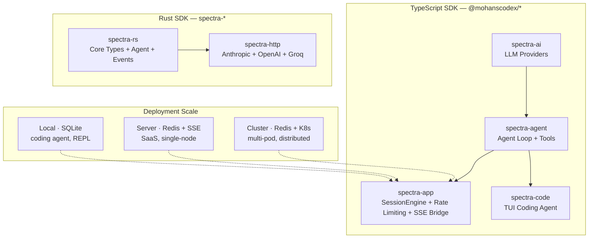

<p align="center">
  
</p>

# Spectra

**Minimal, ultra-fast, multi-language AI agent framework**

[](https://www.typescriptlang.org)
[](https://www.rust-lang.org)
[](LICENSE)

---

A construction kit, not a pre-built house — ship only primitives that enable developers to build anything beyond the core without fighting the framework.

Each SDK (TypeScript, Rust) is a **complete, independent native implementation** — same API surface, same behavior, no shared runtime, no bindings, no FFI.

## Why Spectra?

I built Spectra because I lost months debugging framework bugs instead of building my product.

Every agent framework I tried — **LangChain, LangGraph**, and others — followed the same pattern: endless layers of abstraction for things that are, at their core, just a simple loop. An agent takes input, calls a model, processes the response, dispatches tools, and repeats. That's it. A loop. Everything else — the chains, graphs, runnables, callbacks, tracing hooks, and configurable-everything — is just over-engineering dressed up as architecture.

The cost of this over-engineering is real. I spent weeks tracking down bugs that turned out to be SDK issues, not application logic. Deployment options were limited. And worst of all, these frameworks create **vendor lock-in** — your entire codebase becomes coupled to abstractions you didn't need in the first place.

**Spectra takes the opposite approach.** No graphs. No chains. No runtime that owns your application. Just the primitives — a loop, a model call, a tool dispatch, a stream — that you assemble however you need. If you can write a `for` loop, you can understand the entire framework in 10 minutes.

**Built for hackers who just want things to work. Ship what you mean, not what the framework lets you.**

### "But Spectra has rate limiters, circuit breakers, session stores..."

There's a difference between **abstractions you don't need** and **utilities everyone ends up building anyway.** LangChain invents chains, graphs, and runnables you never asked for. Rate limiting, circuit breakers, session persistence, SSE bridging — those aren't architecture opinions. They're infrastructure you'd write by hand in every production app. Spectra ships them as composable primitives so you don't spend 3 weeks building the same boilerplate every time.

Think of Spectra as two layers: a **lean core** (agent loop + tools + streaming) and a **utility belt** (rate limiting, session stores, health probes) — use what you need, ignore what you don't. The core never forces the belt on you.

## Architecture



## Packages

| Package | Layer | Description |
|---------|-------|-------------|
| `@mohanscodex/spectra-ai` | **Provider** | LLM abstraction — stream, complete, register providers. Anthropic, OpenAI, Groq clients with SSE streaming. Core types (Message, Model, ToolCall, StopReason). |
| `@mohanscodex/spectra-agent` | **Agent** | Agent loop with multi-turn tool dispatch. `defineTool()` with Zod validation, before/after hooks, parallel/sequential execution, retry with backoff, abort support. |
| `@mohanscodex/spectra-app` | **Infrastructure** *(optional)* | Production utilities you'd build anyway — `SessionEngine` (full lifecycle orchestration), `SessionManager` (CRUD + fork + audit/tree), `SessionStore` (in-memory, filesystem, SQLite, Redis), `LocalRateLimiter` + `RedisRateLimiter` (distributed sliding window), `CompositeRateLimiter` (tenant+user+provider), `CircuitBreaker`, `SseBridge` (SSE with WS-compatible interface), `HealthProbe` (K8s ready). Completely optional — the agent works fine without it. |
| `@mohanscodex/spectra-code` | **TUI App** | Terminal-based AI coding agent built on the Spectra SDK. CLI with session management, multi-agent modes (build/plan/debug/explore), MCP server integration, ACP protocol support, security permissions, and file checkpointing. Install globally: `bun add -g @mohanscodex/spectra-code`. |
| `spectra-rs` | **Rust Core** | Rust SDK — core types, agent, tools, events. |
| `spectra-http` | **Rust HTTP** | Rust HTTP clients for Anthropic, OpenAI, Groq, OpenRouter. |

## Feature Matrix

| Feature | TypeScript | Rust |
|---------|------------|------|
| Streaming SSE | ✅ | ✅ |
| Tool Dispatch (Parallel/Sequential) | ✅ | ✅ |
| Before/After Tool Hooks | ✅ | ✅ |
| Extension / Middleware System | ✅ | ✅ |
| Agent Loop (Multi-Turn) | ✅ | ✅ |
| Retry with Exponential Backoff | ✅ | ✅ |
| Session Management | ✅ | — |
| Session Persistence (FS + SQLite) | ✅ | — |
| Redis Session Store (distributed) | ✅ | — |
| Worker Pool | ✅ | ✅ |
| Rate Limiting (in-memory) | ✅ | ✅ |
| Redis Rate Limiting (distributed) | ✅ | — |
| Composite Rate Limiting (tenant+user+provider) | ✅ | — |
| Circuit Breaker | ✅ | ✅ |
| SSE Bridge (WS-compatible interface) | ✅ | — |
| Health Probe (K8s ready) | ✅ | ✅ |
| Agent Registry | ✅ | ✅ |
| Cost Tracking | ✅ | ✅ |
| Tool Choice / Reasoning Effort | ✅ | ✅ |
| Model Registry | ✅ | ✅ |
| Audit Trail / Provenance | ✅ | — |

## Quick Start

### TypeScript

```bash
bun add @mohanscodex/spectra-ai @mohanscodex/spectra-agent
```

```typescript
import { Agent, defineTool } from "@mohanscodex/spectra-agent";
import { z } from "zod";

const searchTool = defineTool({
  name: "search",
  description: "Search the web",
  parameters: z.object({ query: z.string() }),
  execute: async ({ query }) => ({
    content: [{ type: "text", text: `Results for: ${query}` }],
  }),
});

const agent = new Agent({
  model: { id: "claude-sonnet-4-5", provider: "anthropic", api: "messages" },
  systemPrompt: "You are a helpful assistant.",
  tools: [searchTool],
});

for await (const event of agent.run("What is Rust?")) {
  if (event.type === "message_update") {
    console.log(event.message.content);
  }
}
```

### TypeScript — Production

```bash
bun add @mohanscodex/spectra-ai @mohanscodex/spectra-agent @mohanscodex/spectra-app ioredis
```

```typescript
import { SessionEngine, SessionManager, InMemorySessionStore, CompositeRateLimiter, LocalRateLimiter } from "@mohanscodex/spectra-app";

const engine = new SessionEngine({
  sessionManager: new SessionManager(new InMemorySessionStore()),
  rateLimiter: new CompositeRateLimiter([
    { limiter: new LocalRateLimiter(60, 60000), key: "tenant" },
    { limiter: new LocalRateLimiter(10, 60000), key: "user" },
  ]),
  maxConcurrentSessions: 100,
});

engine.start();
const result = await engine.run("user-123", "What is Rust?", undefined, {
  model: { id: "claude-sonnet-4-5", provider: "anthropic", api: "messages" },
});
console.log(result.finalMessage); // "Rust is a systems programming language..."
```

### TypeScript — TUI Coding Agent

```bash
# Install globally (requires Bun)
bun add -g @mohanscodex/spectra-code

# Or via install script
# macOS / Linux
curl -fsSL https://raw.githubusercontent.com/codex-mohan/spectra/main/scripts/install.sh | bash

# Windows
iwr -useb https://raw.githubusercontent.com/codex-mohan/spectra/main/scripts/install.ps1 | iex
```

```bash
# Launch the TUI
spectra

# CLI commands
spectra --help
spectra session list
spectra doctor
```

### Rust

```toml
[dependencies]
spectra-rs = "0.2"
spectra-http = "0.2"
tokio = { version = "1", features = ["full"] }
```

```rust
use spectra_rs::{AgentBuilder, Model, Provider};
use spectra_http::OpenAIClient;

#[tokio::main]
async fn main() -> Result<(), Box<dyn std::error::Error>> {
    let client = OpenAIClient::from_env()?;

    let agent = AgentBuilder::new(Model::new(Provider::OpenAI, "gpt-4o"))
        .system_prompt("You are a helpful assistant.")
        .build(client.into());

    let (mut rx, _channel, _handle) = agent.run("Hello!").await?;

    while let Some(event) = rx.recv().await {
        println!("{:?}", event?);
    }

    Ok(())
}
```

## Supported Providers

| Provider | TypeScript | Rust | Streaming | Tool Use |
|----------|------------|------|-----------|----------|
| **Anthropic** | ✅ | ✅ | SSE | ✅ |
| **OpenAI** | ✅ | ✅ | SSE | ✅ |
| **Groq** | — | ✅ | SSE | — |

## Deployment Architecture

The three TypeScript packages compose for any scale — from local CLI to distributed cloud:

```
                    ┌─────────────────────────────────────┐
                    │        @mohanscodex/spectra-app   │
                    │  SessionEngine ── orchestrates full  │
                    │  request lifecycle                   │
                    │                                      │
                    │  ┌──────────────────────────────┐    │
                    │  │ SessionManager + SessionStore│    │
                    │  │ (InMemory | FS | SQLite |    │    │
                    │  │  Redis + Postgres cold)      │    │
                    │  ├──────────────────────────────┤    │
                    │  │ RateLimiter                  │    │
                    │  │ (Local | Redis | Composite)  │    │
                    │  ├──────────────────────────────┤    │
                    │  │ SseBridge → remote clients   │    │
                    │  ├──────────────────────────────┤    │
                    │  │ HealthProbe → K8s probes     │    │
                    │  └──────────────────────────────┘    │
                    └──────┬──────────────┬────────────────┘
                           │              │
              ┌────────────┴──┐   ┌───────┴──────────┐
              │ spectra-agent │   │   spectra-ai      │
              │ Agent.run()   │   │   stream(model)   │
              │ defineTool()  │   │   registerProvider│
              │ hooks + retry │   │   EventStream     │
              └───────────────┘   └──────────────────┘
```

**Local (coding agent):** SQLite store, no rate limiter, works offline
**Single-server (SaaS MVP):** Redis store + local rate limiter, 1 process
**Multi-pod (production):** Redis store (shared state), Redis rate limiter (distributed), SseBridge for SSE streaming, CompositeRateLimiter for tenant isolation

## Project Structure

```
spectra/
├── packages/
│   ├── ai/              # @mohanscodex/spectra-ai — LLM providers
│   ├── agent/           # @mohanscodex/spectra-agent — Agent + tools
│   ├── app/             # @mohanscodex/spectra-app — SessionEngine + rate limiting + SSE bridge
│   ├── code/            # @mohanscodex/spectra-code — TUI coding agent
├── apps/
│   └── examples/        # Example usage
├── crates/
│   ├── spectra-rs/      # Rust SDK core
│   └── spectra-http/    # Rust HTTP clients
└── .github/workflows/   # CI/CD
```

## Technology Stack

| Component | Technologies |
|-----------|-------------|
| **TypeScript SDK** | TypeScript 5.x · Bun · Vitest · Zod |
| **Rust SDK** | Rust 1.75+ · Tokio · Reqwest (rustls) · serde · thiserror · miette |
| **Tooling** | Turborepo · cargo |

## Rust Constraints

- **Zero `unsafe`** — No unsafe in core logic
- **No OpenSSL** — rustls only, no C dependencies
- **Release profile** — `opt-level = 3`, `lto = "thin"`, `codegen-units = 1`, `panic = "abort"`
- **Edition 2024** — Requires Rust 1.86+

## Development

```bash
# Install
git clone https://github.com/codex-mohan/spectra.git
cd spectra
bun install

# Build all packages
bun run build

# Run tests
bun run test          # TypeScript
cargo test --workspace  # Rust
```

## Credits

Spectra was deeply inspired by **[pi-mono](https://github.com/badlogic/pi-mono)** by **Mario Zechner** — a beautifully minimal AI stack that proved an agent framework doesn't need layers of abstraction to be powerful.

## License

MIT © Mohana Krishna